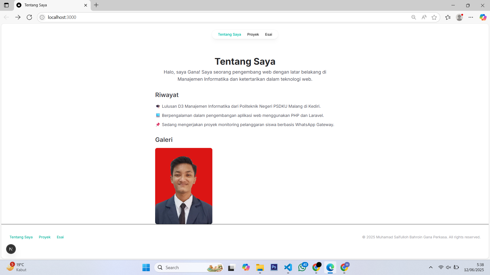
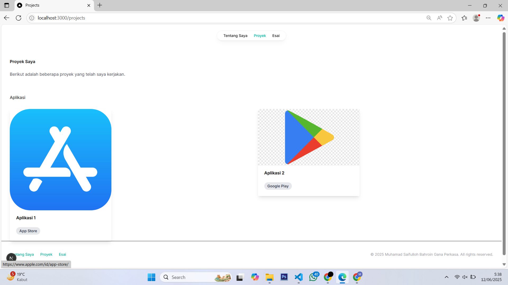

## Laporan Praktikum

|  | Pemrograman Berbasis Framework 2025 |
|--|--|
| NIM |  244107027015|
| Nama |  Muhamad Saifulloh Bahroin Gana Perkasa |
| Kelas | TI - 4K |

### Tugas

1. Modifikasi halaman "Esai" dengan Grid daŌar arƟkel yang telah ditulis.

2. Modifikasi halaman “Tentang Saya” Buat tampilan yang menarik 

## Jawaban

--- Halaman Tentang Saya

--- Halaman Proyek

--- Halaman Esai

### Tugas SEO Pertemuan 6

Lakukan pengujian SEO dengan
1. Gunakan tools seperti Google Search Console untuk memeriksa performa SEO dari suatu
website.

## Jawaban

--- Halaman Setelah menambahkan metadata, favicon, dan Open Graph Tags, Anda dapat menguji SEO dengan
Membuka halaman di browser dan memeriksa elemen HTML menggunakan Developer Tools (Ctrl + Shift
+ I atau F12).
